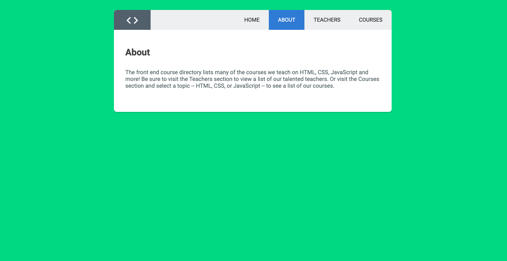

# course-directory

    The course-directory app was bootstraped using create-react-app. This react application is a single web application that uses react-router-dom to match the url with the correct route. It displays some basic information about the Treehouse front end course.

## Example

## index.js

    Main entry point of the application. Renders App.js component to the root div.

## Components

### App.js

    Contains the main routes of the application, directing the app based on the url path using react-router-dom version 6.

### Header.js

    Contains the Navigation links in the header of the application using NavLink to link to different routes of the app.

### Home.js

    The main homepage of the app displaying information about the front end web dev and a form for featured teachers. On submit of the form the app routes to a path using the name and topic as params sending them to the Featured.js page.

### Featured.js

    Uses react-router-dom hook useParams() to get the topic and name of the teacher from the url and displaying custom info based on the params passed to it.

### About.js

    The about page takes in a title prop and displays it to the page with some basic info about the course directory.

### Teachers.js

    The Teachers.js component gets data from the data folder and displays information about each teacher.

### Courses.js

    Imports data from the the data folder and has NavLinks to the HTML, CSS, and JavaScript courses. Depending on which subject is selected the course info is then sent to the CourseContainer component passing the course data down as a prop.

### courses

#### CourseContainer.js

    Takes course data as a prop from the Courses.js component and passes each section of data into the Course.js component.

#### Course.js

    The Course.js takes the data from the CourseContainer.js component and renders the info to the page.

### NotFound.js

    Displays a Page Not Found message and error icon to the page

## Table of Contents

- [course-directory](#course-directory)
  - [Example](#example)
  - [index.js](#indexjs)
  - [Components](#components)
    - [App.js](#appjs)
    - [Header.js](#headerjs)
    - [Home.js](#homejs)
    - [Featured.js](#featuredjs)
    - [About.js](#aboutjs)
    - [Teachers.js](#teachersjs)
    - [Courses.js](#coursesjs)
    - [courses](#courses)
      - [CourseContainer.js](#coursecontainerjs)
      - [Course.js](#coursejs)
    - [NotFound.js](#notfoundjs)
  - [Table of Contents](#table-of-contents)
